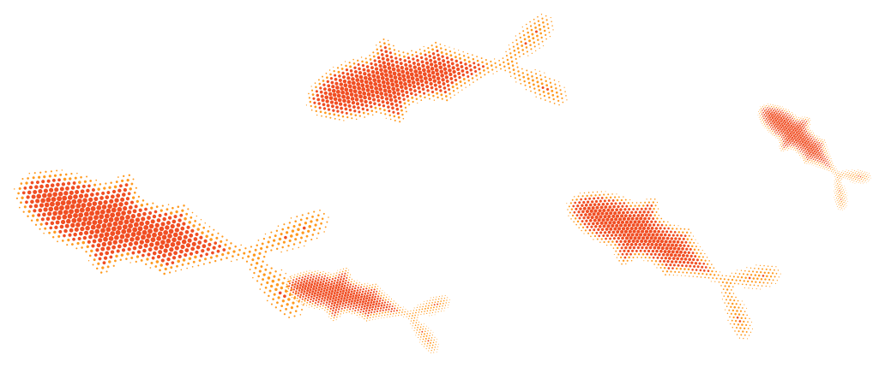

  

<pre>                                                   
 ........................@@............@@............................. 
 .--..-=.*:-=+#..----.:..@@#.==-:---:.+@@.-..:@*-++=#=**++===-:+==---. 
 .==-:...=:-.:@.=........@@@.==-:----.:@@.:.......................:-:. 
 .:-=%@@.=...:@.....=+=..@@%.....:---..@@..:-:++=##=+%-+#+--=--#+#=#+. 
 .--...--+=@.+...@@@@@@@@#*@@@@:.......@@.....=-::---.+=*+#=@:+..:....    Heart Shiana Ursua
 ....+@#-=....@@@@##@@@##*-..@@@@@@....@@.....*-------:.:=..-=.=-----.    -------------------
 .--++.::-...@@@@%=%%#@@@@@#.:+%@@@@@-.@@.....=+...:--::.#..==-..=.=..    Computer Engineer
 ..=+..:--..@@@@@%*@@@@%+...:..=#@@@@@@@@:.:..=-+##=---=-#@#--#@+#=-:.    Embedded Software Engineer
 .--*.@:+..@@@%%@@@@%:.............-@@@@@-..:.=:..:#-:.+*.:+%..-...@+.    Full-Stack Web Developer
 .--*-#...@@@%@@@@#.....-------=-:...%@@@.....-=::#.=*.-..:-.:#+..-%..    UI/UX Designer
 ...=...=+@@@%@@@....-=--------===++-.+@@#...:++%==*::*=#-:*.#@%%@@#.. 
 .+@@=.-.#@@@@@@#..:-.:....:---::--=+-:@@@....:=..*..:-.=#+:-==@@-.+..    Languages: Python, C/C++, JavaScript, SQL
 ....-:@.-@@@@@#...........:-.-........@@@..-.#--==-.+.........@+..+..    Embedded: Embedded C, Firmware Development
 .==#%...@@@@@...=@@@@@@@#=---.-#@@@@@.-@@..::=-...@@@=@@@@@#:..@.=.@.     ESP32, Arduino, UART/SPI, BLE
 ..#+=.@:.+@@=..+-......:%@+=+@@%.....++@%..:.:=%@@+.+-*#=-+#-%-:@-@@.    
 .-+.+-=@@#%@#..+@@@@@@@@*+-.=@#%@@@@@%-@@#...-.............--@=:@.=@.    Web Development: React, Next.js, Flask
 .%=.*-:%#+%@%.....*%*@%=..:.:=.#+@@@@%-@@@..@=..:==+=+##.....==%%@...     PostgreSQL, REST APIs
 ..%+#+::*-%#@.-....:--...-+.=+..---:...%%..@+@@@@@=@%@@.@@@@#=@:=+#:.    
 .+.....-=%@%@--=+=-:...-+....+#:....:+-@@..%-%.:.@.**+:-..+..-#@%+@@.    Tools: Git, GitHub, Linux
 ...--=#.....@#=--=-.=-=+.:-..-=:::-=+*.@@..@*#*##%@@@@+..@@@.*+....#.     PlatformIO, VS Code, Figma
 .----=*@@#=*%##+=---=-::@@@@@@@.:-==+-@@@..%*+*+#@@..=@@.=@-.#+.%=.+. 
 .--:..:....-..@%*+---:...........==+@.@@@..%***##@.#=..@.*@..#*.==@+. 
 .--::*@.:-....-@%#+==*@@@@@@@@#@#%#@@.@@@..@###%%@..=::@#@@#*#.--:... 
 .=#-.......--.=-@%%##=.....==%@#+#@%..@@@..@@@@@@@+.....-%@@@@-.@..=. 
 .--.:-::=-===--.@%%%#%@@@@@@@@#*%@....@@@..@.....@@@*:.......@+#@*:-. 
 .--.---=-=----..@+*%#=.......=#@%@....@@@..@.....@%@@@@%-....%....... 
 ...-=++==+====:.%++#@@@@%%%@@@%##@%:@.@@@..@@**%@@@@@@@@@@#=+-=#=@+#. 
 .::.............#=+####%%%@@%###%@@@@@@@@..@@@@@@@@@@@++@@@@=:--=..*. 
 .------:.....=@=*+===*##***#####*--@@@@@@@@#...........:..-#@%*%*=... 
 ..........%@@@..-+*++++#####**-..+@@@@@@@@@.+=%#=:.....:....@@@+:-++. 
 ......+#@@@@@-.=+*++##*#++=-...@@@@@@@@@@@@.#@@@@@@@%=-..:-.......... 
 @@@@@@@@@%@@@-..-::=++=-....%@@@@@@@@@@@@@@..+=+==--+@@@@+==%@%=..=:. 
 #%%@%@@%@@@@@@...........+@@@@@@@@@@@@@@@@@.*%#@@@@@@%@%@@@@###%#@#:. 
 #%%@%@%@@@@@@@@@@@@@+:%@@@@@@@@@@@@@@@@@@@@....................:+*#*. 
 #%%@@@%@@@@%@@@@@@@@@@@@@@@@@@@@@@@@@@@@@@@.+%@@*:...............=++. 
 #%%@@@%@@@%@@@@%@@@@@@@@@@%%@@@@@@@@@@@@@@@....=#@@@@@@@@@@@@####*++. 
 #%@@@@@%@@%@@@%@@@@@@@@@@%@@@@%@@@@@@@@@@@@@@#**.=%@@@#%+=:....-====. 
 %@%%#@%%@%%@@@%@@%@@@@@@@@@@@%@@@@@@@@@@@@@@@@@@@+-.........-=...:==. 
 %@@@%@@%@@@@%%@@@%@@%@@%%@@@@@@@@%#%%%@@@@@@@@@@@@@@@@@@@@@@@@@@@.-%. 
 @@%@@@@%@@%@@%@@@%@%@@%@@@@@@@%%%@@@@@@@@@@@@@@@@@@@@@@@@@@@@@@@@@... 
 %@@%@@@%@@@@@@@@@@@%@@@@@@@@@@@@@@@@@@@@@@@@@@@@@@@@@@@@@@@@@@@@@@-.. 
  </pre>

